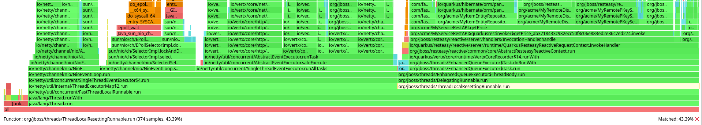
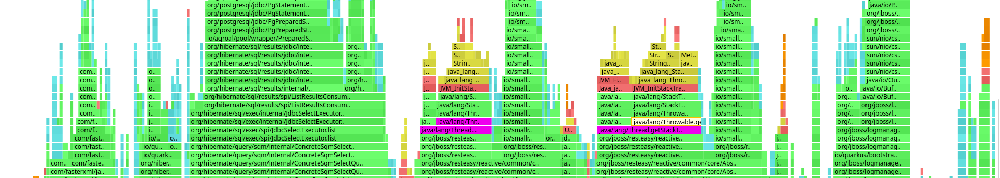

= How sustainable is Quarkus?

A recent interaction lead to the question of "How sustainable is Quarkus?" How does the energy consumption of Quarkus compare to a similar application written in GoLang? How does it compare to Spring Boot?

Join us on a journey of what it means to be "sustainable", how we can measure energy usage and ultimately, how does Quarkus perform?  

It is not a linear journey, and there are pitfalls along the way, but ultimately how Green could your application be if written in Quarkus?

== What does Sustainability mean? 

Many factors;

* scalable 
* productivity
* efficiency

The effects of scalability and productivity are beyond the scope of this post, but further information can be found at http://yyyy.com

**Efficiency - "the ratio of the useful work performed by a machine or in a process to the total energy expended +++<s>or heat taken in</s>+++."**

If efficiency is the ratio of useful work performed to total energy, then for a fixed amount of work a more sustainable machine will expend (or consume) less energy.

A more efficient language or framework will provide the same amount of useful work, whilst consuming less hardware resources compared a less efficient language or framework.

== How does Performance relate to Sustainability?

"Performance is the art of doing nothing"

The fastest programs are programs that do nothing. The most efficient programs are programs that do nothing. But are they useful? 

[cols="1,1,1"]
|===
|Strategy | Efficiency | Usefulness 

| Do absolutely nothing
a|     
| 

| Dynamic runtime Behavior
a|  
a|     

| Low latency Tricks
a| 
a|     

| "Just Right" Balance
a|    
a|      
|=== 

* We are engineers, we are paid to solve problems.  
* What makes sustainability a problem? we have antagonistic goals, we need to produce useful software, quickly (time == money).  Time for a developer is energy. 
* If it takes me 2x as long to write a program, I have spent 2x as much energy.

== It's a balancing act

.Performance is a balancing act 
 

== Measuring Energy

A Dell "Integrated Dell Remote Access Controller" (iDRAC) provides detailed insights into real-time power usage and historical consumption data.

Through the iDRAC interface, it is possible to access key metrics such as instantaneous power consumption, measured in watts. 

This data enables accurate tracking of server energy consumption without the need for external power measurement tools. 

== CPU as a proxy for energy

On a CPU bound benchmark, the CPU is one of the most energy-intensive components in a system. By monitoring CPU utilization, we can estimate how much power is being consumed during software execution. 

While CPU metrics give a solid indication of energy consumption, other components such as memory, disk, and network I/O, also contribute to overall energy use. 

Additionally, factors like thermal management, CPU throttling, and power states (e.g., idle vs. active) can influence actual energy consumption beyond just CPU activity. 

As long as these external factors are controlled, using CPU metrics as a proxy provides a convenient method to assess energy efficiency.

During the tests, the Energy Consumption and mean CPU utilization were measured. It was found that there was a strong correlation between energy consumption and CPU utilization.

== Not all environments are equal

== Running OOTB settings

Running out of the box, with baseline settings;

.Out of the Box baseline

What is interesting is only 43.39% of CPU time is spent processing user requests (useful work)

Of the 43.39% of useful work;

.Out of the Box stack traces

== Performance methodology

=== Active Benchmarking

== NOTES

Issues
======

1 - Low cpu usage -> round robin event loop (4) means threads are busy spinning, polling for packets
2 - Netty native transport
3 - Re-use objects
4 - issue with generating stack trace
5 - Docker stats of 0.5% is 1/2 of one core, not 2 cores
6 - not applies to apples comparison

Methodology 
===========

50% - of quakus & go

compare other runtimes at 50% utilization 

Futher Work
===========

Move to lab
measure energy usage
grab profiles
push into Horreum
analysis with jupyter

need to check allocations
full fat ORM - stateless panache - can we demo
reactive demo
use Hyperfoil to get response time profiles
autotuning
