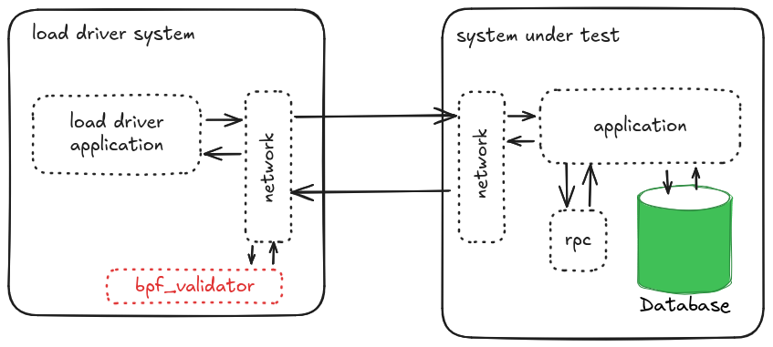

## tldr;

There are many HTTP load drivers available for testing web services, but sometimes they can provide misleading results. 

We often take summary statistics they present at face-value to be accurate, make decisions about performance changes, without validating that the tools we use are correct.

To be confident in the tools that we are using, we need to **test the tester**!

https://github.com/johnaohara/bpf_validator/[bpf_validator] allows us to independently verify that the numbers produced by a Load Driver are not biased, and contain the full sample count.

He tested against https://hyperfoil.io/[Hyperfoil] and https://github.com/giltene/wrk2[wrk2] to confirm the results presented by Hyperfoil are a accurate representation of what happened during a load test.

During our validation, we discovered;

* Hyperfoil to add 0.072ms on average to RTT and the summary statistics reports all requests sent.
* wrk2, under the test conditions, added 0.869ms on average to RTT, but the summary statistics were missing 60.2% of samples.

## What is "Uncoordinated Omission"?

A recent discussion with a colleague focused on the accuracy of results from two different tools performing the same workload. 

This lead to the question, "How accurate are the load generators we use?"

Carrying on from the  link:[coordinated omission] blog post, another accuracy problem that can occur is the "Uncoordinated Omission" problem. 

The omission concept is the same, there is missing data from the summary dataset, but this time there is no co-ordination from the System Under Test (SUT)! 

So rather than argue the merits of each, I decided to not guess and measure.  

But, how do you measure the accuracy of a HTTP load generation tool?

## The Anatomy of a HTTP Load Test

A typical load test will be of the form shown above. 

* **System Under Test (SUT)**: a dedicated system that contains an operating system, hosted application and related process to support the application.  The application typically runs as a service, listening for requests on a particular port.  When a request is revived, the network stack processes the request and pass it to the application, which handles the request and sends a response.
* **Load Driver**: The job of the load driver is to replicate virtual users and measure their experience. Typical measurements include samples of Round Trip Time (RTT) or Throughput (req/sec)

The purpose of the load driver is to characterize the SUT, from the perspective of a virtual user. 

Rather than reporting every single request time, it is typical for a load driver to provide some form of summary statistics describing all the measurements taken during a period of load.

The load driver is responsible for sending the request, processing the response, calculating the RTT, storing measurements and reporting the summary result.

## What can go wrong?

The internal workings of load drivers often remain obscured from the user of these tools, but any problems can have profound effects on the accuracy of data used to determine runtime characteristics of the SUT

* **Inaccurate Recording**: depending on *how* the load driver schedules requests, and therefore how it measures the request / response timestamps, can impact on the whether the load driver skews the results. If it is not possible to measure the bias of the load driver, it is not possible to derive accurate summary data. Moreover, if you were to compare two **different** load drivers, you are unlikely to get the same result.
* **Dropped Measurements**: When summary statistics are presented to an end user of a load driver, validation data is not typically displayed alongside the summary data to ensure the summary data is accurate. It is usually assumed that the summary statistics contain all the samples, and therefore are an accurate representation of the Load the SUT observed during testing.  However, if any of the sample have been dropped by the load driver, then the summary statistics will be under-reporting the actual result.

## How can we test the tester?

What can we do about it?  How can we determine if our load driver is 

* a) accurate
* b) reporting summary results from all the sample

A eBPF script https://github.com/johnaohara/bpf_validator/[bpf_validator] allows us to inject a secondary validation tool directly into the network stack of the Linux Kernel, to record the measure all requests and responses observed from the network layer.  After a load driver run has completed, the https://github.com/johnaohara/bpf_validator/[bpf_validator] will output summary statistics that can be used to validate the statistics reported by the load driver.

This tool can help us measure;

* The overhead any load driver adds to the measurements, either in the processing stack, or due to scheduling algorithms
* If samples are dropped from the summary statistics, and the impact of dropping those samples

### How it Works

`ebpf_validator` injects a eBPF program as a `BPF_PROG_TYPE_SOCKET_FILTER` program on the load driver. This allows the program to inspect socket packets that are sent from or arrive at the load driver.

By filtering out all packets that are sent to, and received from, a specific remote port a timestamp is recorded when a packet is sent and also when a full HTTP response has been received. 

A map of timestamps is maintained within the kernel code, which calculates the RTT for each individual request. The timestamps are sent to a user space application, that records the timestamps in a http://www.hdrhistogram.org/[hdrHistogram]

When the bpf_validator process is sent a `SIGINT` or `SIGTERM` signal, it prints the contents of the https://github.com/HdrHistogram/HdrHistogram[hdrHistogram] to the terminal.

### How to use Bpf Validator

1. Build  `bpf_validator` repository from https://github.com/johnaohara/bpf_validator[github repository], following the https://github.com/johnaohara/bpf_validator/blob/main/README.md#prerequisites[build instructions]

2. Run `bpf_validator` tool to start capturing HTTP Round Trip Times (RTT)

[source,sh,indent=8]
----
$ sudo ./bpf_validator
...
libbpf: map 'bpf_vali.rodata': created successfully, fd=7
libbpf: map '.rodata.str1.1': created successfully, fd=8

bpf_validator is monitoring port: 8000
----

[start=3]
3. Send `SIGINT` (CtRL+C) or `SIGTERM` to the running bpf_validator process to stop monitoring and print the summary statistics

[source,sh,indent=8]
----
$ sudo ./bpf_validator
...
bpf_validator is monitoring port: 8000
^C

Printing HdrHistogram stats:

    Value   Percentile   TotalCount 1/(1-Percentile)

    0.000     1.000000            0          inf
#[Mean    =         -nan, StdDeviation   =         -nan]    <1>
#[Max     =        0.000, Total count    =            0]    <2>
#[Buckets =           22, SubBuckets     =         2048]    <3>

50.0th Percentile: 0.000000                                 <4>
90.0th Percentile: 0.000000
95.0th Percentile: 0.000000
99.0th Percentile: 0.000000
99.9th Percentile: 0.000000
99.99th Percentile: 0.000000

Detailed Percentile spectrum:
    Value   Percentile   TotalCount 1/(1-Percentile)

    0.000     1.000000            0          inf
#[Mean    =         -nan, StdDeviation   =         -nan]
#[Max     =        0.000, Total count    =            0]
#[Buckets =           22, SubBuckets     =         2048]

0 requests in 0.000000s                                     <5>
Av Throughput: -nan req/sec                                 <6>
----
<1> Summary Statistics
<2> Total number of samples in histogram
<3> Histogram bucketing details
<4> Percentile response Times
<5> Total request count and time between first and last HTTP packet
<6> Average throughput: total requests / time difference between first and last HTTP packet

## Lets Test!

For a simple test, we can run a https://quarkus.io/[Quarkus] application which you can obtain by clicking "Generate your application" at https://code.quarkus.io/

[source,sh,indent=4]
----

$ mvn clean package
...
[INFO] ------------------------------------------------------------------------
[INFO] BUILD SUCCESS
[INFO] ------------------------------------------------------------------------
...

$ mvn quarkus:dev -Dquarkus.http.port=8000
...
__  ____  __  _____   ___  __ ____  ______ 
--/ __ \/ / / / _ | / _ \/ //_/ / / / __/ 
-/ /_/ / /_/ / __ |/ , _/ ,< / /_/ /\ \   
--\___\_\____/_/ |_/_/|_/_/|_|\____/___/   
2024-12-03 14:59:37,947 INFO  [io.quarkus] (Quarkus Main Thread) code-with-quarkus 1.0.0-SNAPSHOT on JVM (powered by Quarkus 3.17.2) started in 2.072s. Listening on: http://localhost:8000

2024-12-03 14:59:37,950 INFO  [io.quarkus] (Quarkus Main Thread) Profile dev activated. Live Coding activated.
2024-12-03 14:59:37,950 INFO  [io.quarkus] (Quarkus Main Thread) Installed features: [cdi, rest, smallrye-context-propagation, vertx]

----

In another terminal, start `bpf_validator` running:

[source,sh,indent=4]
----
$ sudo ./bpf_validator 
...
bpf_validator is monitoring port: 8000

----

From a 3rd terminal, start a https://hyperfoil.io/[Hyperfoil] load driver:

[source,sh,indent=4]
----
$ jbang wrk2@hyperfoil -R 5000 -c 10 -t 2 -d 20s  http://localhost:8000/hello
Running 20s test @ http://localhost:8000/hello
  2 threads and 10 connections
----

After the Hyperfoil load driver has complete, type `CTRL+C` in the `bpf_validator` terminal to obtain the summary statistics:

[source,sh,indent=4]
----
$ sudo ./bpf_validator 
...
bpf_validator is monitoring port: 8000
^C

Printing HdrHistogram stats:
...
----

## What can we see?

### Hyperfoil

[source,sh,indent=4]
----
$ jbang wrk2@hyperfoil -R 5000 -c 10 -t 2 -d 20s  http://localhost:8000/hello
Running 20s test @ http://localhost:8000/hello
2 threads and 10 connections
Thread Stats   Avg      Stdev     Max   +/- Stdev
    Latency   312.18μs  227.26μs  13.24ms   96.66%          <1>
    Req/Sec   4761.95   1063.69  5005.00     95.24
100001 requests in 20.002s,  13.54MB read                   <2>
Requests/sec: 4999.55                                       <3>
Transfer/sec: 693.30kB

----
<1> The average RTT was 0.312 ms, with a max response time of 13.24ms
<2> A total of 100001 requests sent in 20.002 seconds
<3> The mean request rate was 4999.55 rps, compared to the required rate of `-R 5000`

compared to:

[source,sh,indent=4]
----
...
#[Mean    =        0.240, StdDeviation   =        0.101]    <1>
#[Max     =        3.846, Total count    =       129987]    <2>
#[Buckets =           22, SubBuckets     =         2048]

50.0th Percentile: 0.222847
90.0th Percentile: 0.344063
95.0th Percentile: 0.386303
99.0th Percentile: 0.476927
99.9th Percentile: 1.159167
99.99th Percentile: 3.102719

129987 requests in 26.011347s                               <3>
Av Throughput: 4997.318998 req/sec                          <4>
----
<1> The average RTT was 0.240 ms
<2> The max response time of 3.846ms
<3> A total of 129987 requests sent in 26.011 seconds
<4> The mean request rate was 4997.31 rps

[NOTE]
====
**Processing the RTT in `Hyperfoil` is taking on average 0.072ms**

* `Hyperfoil` reports a mean RTT of `0.312ms`, compared to `0.240ms` for `bpf_validator`.

**The max overhead added by `Hyperfoil` is 9.394ms**

* The **max** response time reported by `Hyperfoil` is `13.24ms`, compared to `3.846ms` reported by `bpf_validator`.

**Hyperfoil warms up for 6.0s, which is captured in the `bpf_validator` statistics**

* `Hyperfoil` was started with the command line argument `-d 20s`, a duration of 20 seconds. `Hyperfoil` reports `100001 requests in 20.002s`, whereas `bpf_validator` reports `129987 requests in 26.011347s`.  For the wrk2 `Hyperfoil` script, a "calibration" phase is performed for 6 seconds. This phase is not reported, but is captured by `bpf_validator`.

**The Target rate of ~5000 requests/second is reported by both methods**
====

## Comparison against another popular tool

### wrk2 - https://github.com/giltene/wrk2[https://github.com/giltene/wrk2]

In the first example, we were using the `Hyperfoil` wrk2 emulator, so lets compare against the original `wrk2` tool

[source,sh,indent=4]
----
$ wrk2 -R 5000 -c 10 -t 2 -d 20s http://localhost:8000/hello
Running 20s test @ http://localhost:8000/hello
  2 threads and 10 connections
  Thread calibration: mean lat.: 1.072ms, rate sampling interval: 10ms
  Thread calibration: mean lat.: 1.092ms, rate sampling interval: 10ms
  Thread Stats   Avg      Stdev     Max   +/- Stdev
    Latency     1.09ms  454.72us   3.35ms   61.54%          <1>
    Req/Sec     2.62k   134.50     3.22k    71.59%
  99951 requests in 20.00s, 9.72MB read                     <2>
Requests/sec:   4997.40                                     <3>
Transfer/sec:    497.79KB

----
<1> The average RTT was 1.09 ms, with a max response time of 3.35ms
<2> A total of 99951 requests sent in 20.00 seconds
<3> The mean request rate was 4997.40 rps, compared to the required rate of `-R 5000`

compared to: 

[source,sh,indent=4]
----
...
#[Mean    =        0.221, StdDeviation   =        0.102]    <1>
#[Max     =       19.464, Total count    =        99954]    <2>
#[Buckets =           22, SubBuckets     =         2048]

50.0th Percentile: 0.202495
90.0th Percentile: 0.315903
95.0th Percentile: 0.365567
99.0th Percentile: 0.487679
99.9th Percentile: 0.841215
99.99th Percentile: 1.735679

99954 requests in 9995496s                                  <3>
Av Throughput: 4995.602928 req/sec                          <4>
----
<1> The average RTT was 0.221 ms
<2> The max response time of 19.464ms
<3> A total of 99954 requests sent in 99954 seconds
<4> The mean request rate was 4995.60 rps

[NOTE]
====
**Processing the RTT in `wrk2` is taking on average 0.869ms**

**The max response time reported by `wrk2` is less than the actual maximum response time recorded by `bpf_validator **.
====

== What about Centiles?

We can re-run the tests, adding the `--latency` flag to the command line arguments to validate the RTT centile distributions

### Hyperfoil

[source,sh,indent=4]
----
$ jbang wrk2@hyperfoil -R 5000 -c 10 -t 2 -d 20s --latency http://localhost:8000/hello
Running 20s test @ http://localhost:8000/hello
2 threads and 10 connections
...
  Latency Distribution
     50.000%    204.80μs                                    <1>
     75.000%    243.71μs
     90.000%    288.77μs
     99.000%    387.07μs                                    <2>
     99.900%    536.58μs
     99.990%      2.24ms
     99.999%      2.46ms
    100.000%      2.46ms
...
#[Mean    =         0.22, StdDeviation   =         0.07]    
#[Max     =         2.46, Total count    =       100001]    <3>
#[Buckets =           29, SubBuckets     =          256]
----------------------------------------------------------
  100001 requests in 20.002s,  13.54MB read                 <4>
Requests/sec: 4999.55                                       
Transfer/sec: 693.30kB
----
<1> The median RTT (50th centile) was 0.205 ms
<2> The 99th centile was 0.387 ms
<3> 100001 samples were captured in the histogram
<4> 100001 requests were captured in total during the test

compared to:

[source,sh,indent=4]
----
...
#[Mean    =        0.175, StdDeviation   =        0.067]    
#[Max     =        2.820, Total count    =       129987]    <1>
#[Buckets =           22, SubBuckets     =         2048]

50.0th Percentile: 0.161919                                 <2>
90.0th Percentile: 0.248447
95.0th Percentile: 0.278015
99.0th Percentile: 0.349439                                 <3>
99.9th Percentile: 0.555519
99.99th Percentile: 2.222079

129987 requests in 26.010391s                               <4>
Av Throughput: 4997.502821 req/sec
----
<1> 129987 samples were captured in the histogram
<2> The median RTT (50th centile) was 0.162 ms
<3> The 99th centile was 0.349 ms
<4> 129987 requests were captured in total during the test

[NOTE]
====
**Processing the RTT in `Hyperfoil` is taking 0.042ms for the median response**

* `Hyperfoil` reports a 50th centile of`0.205 ms`, compared to `0.162 ms` for `bpf_validator`.

**Processing the RTT in `Hyperfoil` is taking 0.038ms for the 99.0th centile response**

* `Hyperfoil` reports a 99th centile of`0.387 ms`, compared to `0.349 ms` for `bpf_validator`.

**All of the requests were captured and used to calculate the RTT histogram and summary statistics**
====

### wrk2

[source,sh,indent=4]
----
$ jbang wrk2@hyperfoil -R 5000 -c 10 -t 2 -d 20s --latency http://localhost:8000/hello
Running 20s test @ http://localhost:8000/hello
2 threads and 10 connections
...
  Thread Stats   Avg      Stdev     Max   +/- Stdev
    Latency     1.40ms  686.09us   6.55ms   70.96%          <1>
    Req/Sec     2.62k     2.19k   10.67k    84.49%          <2>
  Latency Distribution (HdrHistogram - Recorded Latency)
 50.000%    1.32ms                                          <3>
 75.000%    1.75ms
 90.000%    2.27ms
 99.000%    3.43ms                                          <4>
 99.900%    4.44ms
 99.990%    6.29ms
 99.999%    6.55ms
100.000%    6.55ms
...
#[Mean    =        1.401, StdDeviation   =        0.686]
#[Max     =        6.548, Total count    =        36875]    <5>
#[Buckets =           27, SubBuckets     =         2048]
----------------------------------------------------------
  92597 requests in 20.00s, 9.01MB read                     <6>
  Socket errors: connect 5, read 0, write 0, timeout 40
Requests/sec:   4629.49                                     <7>
Transfer/sec:    461.14KB
----
<1> The average RTT was 1.40 ms, with a max response time of 6.55 ms
<2> The request rate reported by the summary statistics was 2620 rps
<3> The median RTT (50th centile) was 1.32 ms
<4> The 99th centile was 3.43 ms
<5> 36875 samples were captured in the histogram
<6> 92597 requests were captured in total during the test
<7> The overall reported `Requests/sec` was 4629.5

compared to:

[source,sh,indent=4]
----
...
#[Mean    =        0.342, StdDeviation   =        0.442]    <1>
#[Max     =        8.610, Total count    =        92603]    <2>
#[Buckets =           22, SubBuckets     =         2048]

50.0th Percentile: 0.232959                                 <3>
90.0th Percentile: 0.631807
95.0th Percentile: 0.786431
99.0th Percentile: 1.176575                                 <4>
99.9th Percentile: 7.917567
99.99th Percentile: 8.560639

92603 requests in 18.007651s                                <5>
Av Throughput: 5142.425405 req/sec                          <6>

----
<1> The average RTT was 0.240 ms
<2> There was a total of 92603 requests recorded in the hdrHistorgram
<3> The median RTT (50th centile) was 0.233 ms
<4> The 99th centile was 1.18 ms
<5> In total 92603 requests were sent in 18.01s
<6> The actual request rate was 5142.4 req/sec

[NOTE]
====
**The Req/Seq reported by the summary statistics was 2620 rps, whereas the overall rps was reported as 4629.5**

* wrk recorded 92597 requests overall, and only 36875 samples were recorded in the summary statistics, compared to 92603 samples recorded by `bpf_validator`

**wrk2 dropped 55728 samples (60.2%) of samples from the summary statistics**

**The only indication that there was an issue with capturing samples was the summary request rate (2620 rps) was different from the overall request rate (4629.5 rps)**
====